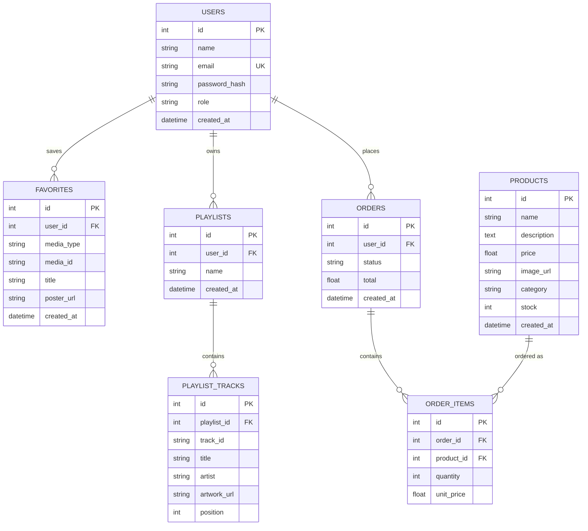

# Astilo — Database Documentation

Relational schema backing the CherryPy API (`astilo-project-be`). Defined in
SQLAlchemy at [`app/models.py`](../app/models.py); this document is the
canonical reference for what's actually created by `init_db()` today, plus
the reasoning behind each design choice.

Engine-agnostic: runs on SQLite (default, zero setup) and PostgreSQL 16
(`DATABASE_URL` swap, see [`README.md`](../README.md)) without schema changes.

## Scope

Movie, anime, and lyrics data are **not** stored here — they're fetched live
from TMDB/Jikan/Genius and proxied or called client-side. This database owns
only what's actually *ours*: accounts, saved references to that external
media, playlists, and the store.

---

## Entity-relationship diagram

---

## Tables

### `users`

The account behind every favorite, playlist, and order.

| Column | Type | Constraints | Notes |
|---|---|---|---|
| `id` | INTEGER | PK, autoincrement | |
| `name` | VARCHAR(120) | NOT NULL | Display name |
| `email` | VARCHAR(255) | NOT NULL, UNIQUE, indexed | Login identifier |
| `password_hash` | VARCHAR(255) | NOT NULL | bcrypt hash — plaintext is never stored |
| `role` | VARCHAR(20) | NOT NULL, default `'user'` | `user` \| `admin` |
| `created_at` | DATETIME | default now (UTC) | |

**Why no `username` field:** email is the single login identifier — one less
uniqueness constraint to manage, and matches how the frontend's Login screen
is already built.

**Why `role` is a plain string, not a separate roles table:** two fixed
values (`user`/`admin`) with no per-role permission sets yet. A join table
would be premature — revisit if roles grow beyond a flag.

---

### `favorites`

A saved reference to an external movie/anime/track. Astilo doesn't own this
media — TMDB/Jikan/a music provider does — so we store just enough to render
a "My List" row without re-fetching on every page load.

| Column | Type | Constraints | Notes |
|---|---|---|---|
| `id` | INTEGER | PK | |
| `user_id` | INTEGER | FK → `users.id`, NOT NULL | |
| `media_type` | VARCHAR(20) | NOT NULL | `movie` \| `anime` \| `track` |
| `media_id` | VARCHAR(64) | NOT NULL | External id (TMDB id, Jikan id, etc.) |
| `title` | VARCHAR(255) | | Denormalized snapshot for display |
| `poster_url` | VARCHAR(500) | | Denormalized snapshot for display |
| `created_at` | DATETIME | default now | |

**Constraint:** `UNIQUE(user_id, media_type, media_id)` — a user can favorite
"Fight Club" (TMDB id 550) exactly once; a repeat `POST` is idempotent
(returns the existing row rather than erroring).

**Why one table for three media types instead of three tables:** the shape
is identical (an external id + a title + an artwork url), and the frontend
already treats "my favorites" as one concept filtered by tab. Three near-
identical tables would mean three near-identical controllers for no relational
benefit — `media_type` is the discriminator instead.

**Why denormalize `title`/`poster_url` here** rather than re-querying TMDB
by `media_id` on every list load: favorites lists render fast and stay
correct even if the external API is down or rate-limited. The tradeoff — a
title going stale if TMDB updates it — doesn't matter for movie/anime titles
in practice.

---

### `playlists`

A user-created music playlist.

| Column | Type | Constraints | Notes |
|---|---|---|---|
| `id` | INTEGER | PK | |
| `user_id` | INTEGER | FK → `users.id`, NOT NULL | |
| `name` | VARCHAR(120) | NOT NULL | |
| `created_at` | DATETIME | default now | |

### `playlist_tracks`

Tracks within a playlist, in order.

| Column | Type | Constraints | Notes |
|---|---|---|---|
| `id` | INTEGER | PK | |
| `playlist_id` | INTEGER | FK → `playlists.id`, NOT NULL | |
| `track_id` | VARCHAR(64) | NOT NULL | External id from the music provider |
| `title` | VARCHAR(255) | | Denormalized snapshot |
| `artist` | VARCHAR(255) | | Denormalized snapshot |
| `artwork_url` | VARCHAR(500) | | Denormalized snapshot |
| `position` | INTEGER | default 0 | Sort order within the playlist |

**Why a separate table instead of a JSON array column on `playlists`:**
individual tracks need their own identity for deletion (`DELETE
/playlists/:id/tracks/:trackId`) and reordering later — an array column
would mean rewriting the whole list for a one-track removal. Postgres'
native array/JSONB support is tempting, but a plain join table keeps the
schema portable to SQLite too (SQLite has no array type).

---

### `products`

The store catalog.

| Column | Type | Constraints | Notes |
|---|---|---|---|
| `id` | INTEGER | PK | |
| `name` | VARCHAR(255) | NOT NULL | |
| `description` | TEXT | | |
| `price` | FLOAT | NOT NULL | Unit price |
| `image_url` | VARCHAR(500) | | |
| `category` | VARCHAR(100) | | Free-text filter, e.g. `apparel`, `accessories` |
| `stock` | INTEGER | default 0 | Decremented atomically at checkout |
| `created_at` | DATETIME | default now | |

**Why `category` is a free-text column, not a `categories` table:** the
store has no category management UI yet (no create/rename/merge flow) — a
join table buys nothing until that exists. `GET /store/products?category=`
already filters on it as-is; promoting it to its own table is a
non-breaking migration later; no schema decision here forecloses it.

**Why price is `FLOAT` and not `DECIMAL`:** fine for a small storefront's
current dollar-and-cents catalog; if real payment processing lands, switch
to `NUMERIC(10,2)` before real money touches this table — this is the one
column in the schema I'd flag first for a payments follow-up.

---

### `orders` / `order_items`

An order header plus its line items, split the standard way so an order can
hold many products at different quantities/prices without repeating the
order's own metadata per line.

**`orders`**

| Column | Type | Constraints | Notes |
|---|---|---|---|
| `id` | INTEGER | PK | |
| `user_id` | INTEGER | FK → `users.id`, NOT NULL | |
| `status` | VARCHAR(20) | NOT NULL, default `'pending'` | `pending` \| `paid` \| `shipped` \| `cancelled` |
| `total` | FLOAT | NOT NULL, default 0 | Sum of `order_items.unit_price * quantity` at checkout time |
| `created_at` | DATETIME | default now | |

**`order_items`**

| Column | Type | Constraints | Notes |
|---|---|---|---|
| `id` | INTEGER | PK | |
| `order_id` | INTEGER | FK → `orders.id`, NOT NULL | |
| `product_id` | INTEGER | FK → `products.id`, NOT NULL | |
| `quantity` | INTEGER | NOT NULL, default 1 | |
| `unit_price` | FLOAT | NOT NULL | **Snapshot** of `products.price` at order time |

**Why `unit_price` is copied onto the line item instead of joining
`products.price` at read time:** if the product's price changes next month,
last month's order must still show what the customer actually paid. This is
the one place in the schema where denormalization is load-bearing, not just
a read-performance shortcut.

---

## Relationships summary

| Relationship | Cardinality | On delete |
|---|---|---|
| `users` → `favorites` | one-to-many | cascade (delete user ⇒ delete their favorites) |
| `users` → `playlists` | one-to-many | cascade |
| `playlists` → `playlist_tracks` | one-to-many | cascade |
| `users` → `orders` | one-to-many | cascade |
| `orders` → `order_items` | one-to-many | cascade |
| `products` → `order_items` | one-to-many | **no cascade** — see below |

**Why `products` → `order_items` doesn't cascade:** deleting a product must
never silently erase historical order records. In practice the
`ProductsController.DELETE` should be changed to soft-delete (an
`is_active`/`archived_at` flag) once orders exist against real products —
today it hard-deletes because the catalog is still empty. Flagging this now
so it isn't forgotten when the store goes live.

---

## Indexes

Beyond primary keys (indexed automatically):

- `users.email` — explicit index (`index=True`), since every login and every
  `Authorization` check resolves through it.
- `favorites(user_id, media_type, media_id)` — the `UNIQUE` constraint
  doubles as a composite index, serving both the dedupe check and the
  `GET /favorites?media_type=` filter.

**Not yet indexed, worth adding once data volume matters:**
- `orders.user_id`, `playlists.user_id`, `favorites.user_id` — every "list
  my X" query filters on these FKs; SQLite/Postgres won't auto-index a
  plain foreign key the way a primary key is indexed.
- `products.category` — once the catalog is large enough that category
  filtering is a real query pattern rather than a handful of rows.

---

## What's deliberately *not* modeled yet

Called out so a future migration isn't a surprise:

- **Password reset / email verification tokens** — no table yet; add a
  `password_reset_tokens(user_id, token_hash, expires_at)` table when that
  flow is built, rather than bolting fields onto `users`.
- **Sessions / refresh tokens** — auth is currently a single long-lived JWT
  with no server-side revocation list. A `refresh_tokens` table is the
  natural addition if logout-everywhere or token rotation is needed.
- **Reviews/ratings** — flagged in the earlier product discussion as a
  likely next feature; would be its own `reviews(user_id, media_type,
  media_id, rating, body)` table, following the same discriminator pattern
  as `favorites`.
- **Shipping address** — `orders` has no address fields; needed before
  checkout is real rather than a stock-decrement demo.
